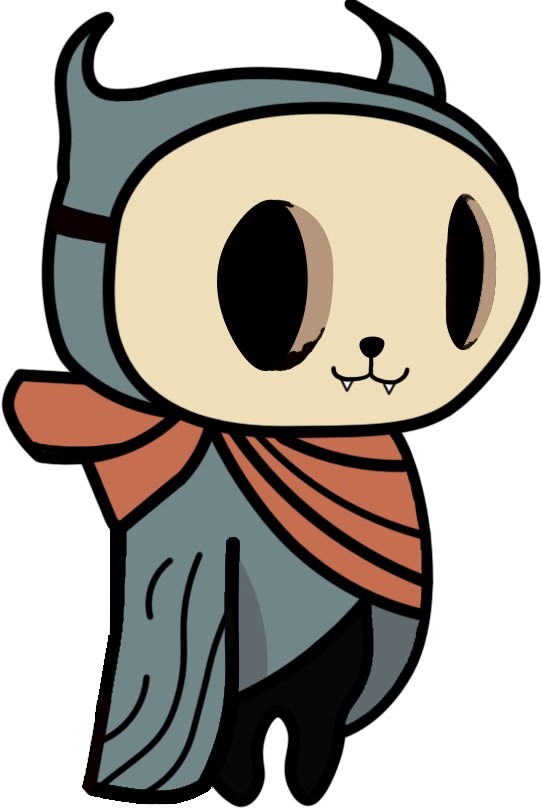

[![LinkedIn][linkedin-shield]][linkedin-url]
[![GitHub][github-shield]][github-url]
[![itch.io][itch-shield]][itch-url]
[![Instagram][instagram-shield]][instagram-url]
[![Youtube][youtube-shield]][youtube-url]
[![ArtStation][artstation-shield]][artstation-url]

<!-- PROJECT LOGO -->
 

  

<h3 align="center">A Life's End</h3>

  

    A 2D Action-Adventure Platformer Game with an emphasis on its story within a fantasy world, “Metroidvania” style.

Encourages player exploration by offering puzzles, side quests, interactions with different NPCs and collectables along the way.

This game was created during the last semester of my bachelor's degree as a bachelor's thesis. The project took approximately 3 months to be developed and involved design, programming and tests topics. It can be characterized as a total development of a game.
     
     
    >>
    <a href="https://github.com/github_username/repo_name/youtubevideo">View Demo</a>
    .
    <a href="https://barrythecoolbee.itch.io/a-lifes-end">itch.io</a>
    <<
  

<!-- ABOUT THE PROJECT -->
## About The Project

It's a haunted world by the unfulfilled desires of the various spirits that inhabit it. Helping these inhabitants gives them back the peace and tranquillity of a lifetime accomplished, also making it easier to fulfil the mission given to the character and giving a new colour and light to the world in which they find themselves.

It thus has the objective of representing the good and bad phases of life and, consequently, dealing with emotionally sensitive topics, such as death.

The character named “Misty” is a little adventurer who lived their whole life accompanied by their best friend “Nuri”.  

On an expedition to the world "Mythic Domain", Misty's friend is kidnapped by an evil spirit and taken to a very distant place, ending up separating them. 

From now on the character sets off on a new adventure with the goal of rescuing their old friend from this treacherous world.

(<a href="#top">back to top</a>)

### Built With

* [C#](https://en.wikipedia.org/wiki/C_Sharp_(programming_language))
* [Unity](https://unity.com/)

(<a href="#top">back to top</a>)

## Credits

Programmer / Artist /  Level Designer - Beatriz Sá

Programmer / Level Designer - Luís Farinha

(<a href="#top">back to top</a>)

<!-- CONTACT -->
## Contact

Email - beatrizsa1906@gmail.com

Portfolio - Still in Development

Itch.io - [https://barrythecoolbee.itch.io/](https://barrythecoolbee.itch.io/)

LinkedIn - [https://www.linkedin.com/in/beatriz-s%C3%A1-857a64222/](https://www.linkedin.com/in/beatriz-s%C3%A1-857a64222/)

Instagram - [https://www.instagram.com/barrythecoolbee/](https://www.instagram.com/barrythecoolbee/)

Youtube - [https://www.youtube.com/channel/UCuzo8NbNm7MCut_lDQ7WNvw](https://www.youtube.com/channel/UCuzo8NbNm7MCut_lDQ7WNvw)

ArtStation - [https://www.artstation.com/barrythecoolbee](https://www.artstation.com/barrythecoolbee)

Project Link - [https://github.com/barrythecoolbee/A-Life-s-End](https://github.com/barrythecoolbee/A-Life-s-End)

(<a href="#top">back to top</a>)

[linkedin-shield]: https://img.shields.io/badge/-LinkedIn-black.svg?style=for-the-badge&logo=linkedin&colorB=555
[linkedin-url]: https://www.linkedin.com/in/beatriz-s%C3%A1-857a64222/
[github-shield]: https://img.shields.io/badge/-GitHub-black.svg?style=for-the-badge&logo=github&colorB=555
[github-url]: https://github.com/barrythecoolbee
[itch-shield]: https://img.shields.io/badge/-itch.io-black.svg?style=for-the-badge&logo=itch.io&colorB=555
[itch-url]: https://barrythecoolbee.itch.io/
[instagram-shield]: https://img.shields.io/badge/-Instagram-black.svg?style=for-the-badge&logo=instagram&colorB=555
[instagram-url]: https://www.instagram.com/barrythecoolbee/
[youtube-shield]: https://img.shields.io/badge/-Youtube-black.svg?style=for-the-badge&logo=youtube&colorB=555
[youtube-url]: https://www.youtube.com/channel/UCuzo8NbNm7MCut_lDQ7WNvw
[artstation-shield]: https://img.shields.io/badge/-ArtStation-black.svg?style=for-the-badge&logo=artstation&colorB=555
[artstation-url]: https://www.artstation.com/barrythecoolbee
